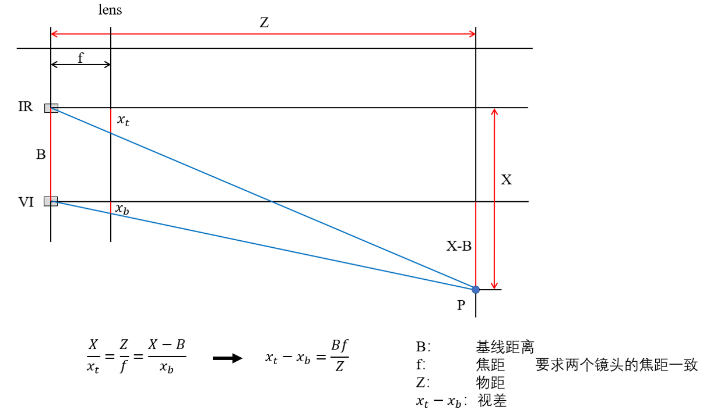
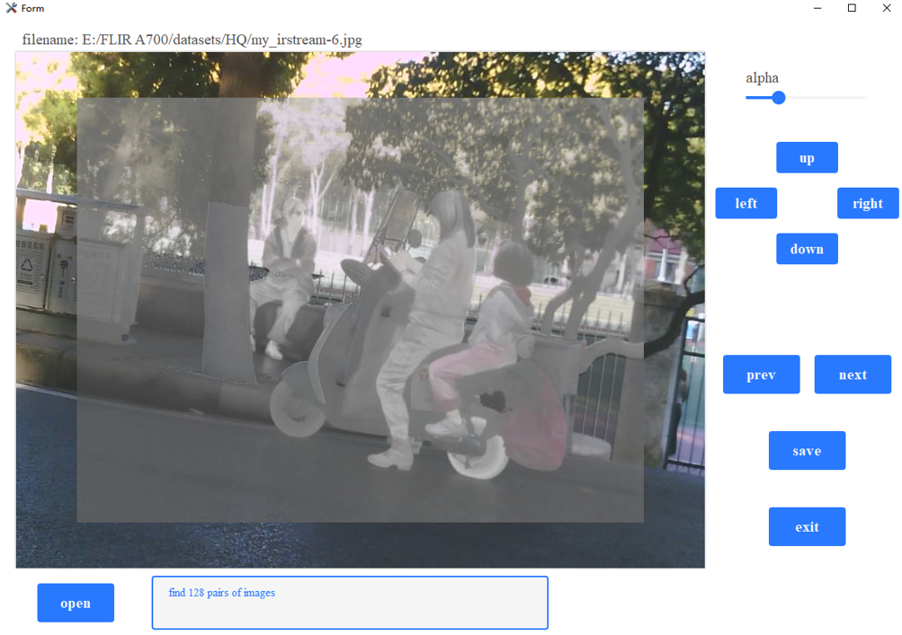

## FLIR A700 dual camera image registration tool
Register the infrared and visible images captured by FLIR A700 and save  
The images capture tool is available [here](https://github.com/frostcza/FLIR-A700-program)  

### camera specifications
IR: f = 17mm  FOV = 24°×18°  640 × 480  
VI: f = 17mm  FOV = 40°×30°  1280 × 960  

baseline ≈ 23.5mm  

### python environment
python 3.7  
PyQt5  5.15.2  
pyqt5-tools  
opencv-python 3.4.15 
pyinstaller  

### run 
#### run in python
`python run_reg_tool.py`  
Press `up/down/left/right` to perform precise alignment  
Drag the slider bar to control transparency  
Press `save` to save the registered images  

#### build exe
`pyinstaller -F -w --add-data "custom.css;." --add-data "tools.ico;." run_reg_tool.py --hidden-import reg_tool_ui.py --icon=tools.ico `  

